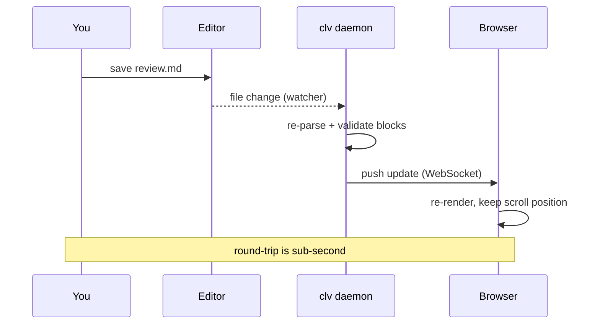

# clv — the README that reads itself

> This is the **clv-flavored** README. It is the same project as [`README.md`](README.md),
> but written to be opened _in clv_. On GitHub the blocks below show up as raw JSON;
> that is the point — clv is what turns them into callouts, charts, graphs, and diffs.

````clv:callout title="You are (probably) reading this wrong"
{
  "id": "intro",
  "kind": "info",
  "body": "If you see walls of `{ ... }` below, you're looking at the raw source. Render it the way it was meant to be read:\n\n```bash\nbunx @5n7/clv README.clv.md\n```\n\nThen come back. Everything past this point is a live demonstration of what `clv` does to a Markdown file."
}
````

```clv:metrics title="clv at a glance"
{
  "id": "metrics-glance",
  "columns": 4,
  "items": [
    { "label": "Block types", "value": 14, "hint": "all of them used in this very file" },
    { "label": "Files emitted by --output", "value": 1, "delta": "self-contained", "trend": "neutral", "hint": "JS, CSS, fonts, images, all inlined" },
    { "label": "Network calls at runtime", "value": 0, "trend": "down", "hint": "static export makes none" },
    { "label": "Default port", "value": 7421, "hint": "one daemon for every file you open" }
  ]
}
```

## What clv is

`clv` turns Markdown that Claude Code writes into a rich, live preview you can read in any
browser. Claude embeds small JSON blocks (`` ```clv:<type> ``) in its review or explanation
output; `clv` parses them, validates each against a schema, and renders them as the blocks
you are looking at right now — callouts, annotated code, diffs, charts, dependency graphs,
step-by-step walkthroughs, and more.

Point it at one file for a live-reloading preview, at many files for a sidebar you can
navigate, or pass `--output` to freeze everything into a single HTML file you can email.

```clv:graph title="How a Markdown file becomes this page"
{
  "id": "graph-pipeline",
  "direction": "LR",
  "nodes": [
    { "id": "md", "label": "your .md file", "group": "ext" },
    { "id": "cli", "label": "clv CLI", "group": "api" },
    { "id": "daemon", "label": "background daemon :7421", "group": "svc" },
    { "id": "parse", "label": "parse + schema-validate", "group": "svc" },
    { "id": "ws", "label": "WebSocket push", "group": "db" },
    { "id": "viewer", "label": "React viewer", "group": "ext" },
    { "id": "html", "label": "single .html (--output)", "group": "db" }
  ],
  "edges": [
    { "from": "md", "to": "cli", "label": "open / watch" },
    { "from": "cli", "to": "daemon", "label": "register paths" },
    { "from": "daemon", "to": "parse" },
    { "from": "parse", "to": "ws", "label": "on save" },
    { "from": "ws", "to": "viewer", "label": "live reload" },
    { "from": "parse", "to": "html", "label": "static export", "style": "dashed" }
  ]
}
```

## Install

The npm package is published as `@5n7/clv`, but the command it installs is `clv`.

```clv:tabs title="Three ways to run it"
{
  "id": "tabs-install",
  "tabs": [
    {
      "label": "One-off (bunx)",
      "block": {
        "type": "code",
        "data": { "lang": "bash", "source": "# No install — fetch and run\nbunx @5n7/clv README.clv.md" }
      }
    },
    {
      "label": "Global",
      "block": {
        "type": "code",
        "data": { "lang": "bash", "source": "# Install once; the command is then `clv`\nbun add -g @5n7/clv\nclv README.clv.md" }
      }
    },
    {
      "label": "From source",
      "block": {
        "type": "code",
        "data": { "lang": "bash", "source": "# Requires Bun (https://bun.sh)\nbun install\nbun run build\nbun run src/cli/index.ts README.clv.md" }
      }
    }
  ]
}
```

## Quick start

```clv:steps title="From zero to a live preview"
{
  "id": "steps-start",
  "initial": 0,
  "steps": [
    {
      "title": "Open a file",
      "body": "Hand `clv` a Markdown file. It starts a background daemon on `localhost:7421` and opens your browser.",
      "block": {
        "type": "code",
        "data": { "lang": "bash", "source": "bunx @5n7/clv review.md" }
      }
    },
    {
      "title": "Edit and watch it reload",
      "body": "Save the file and the browser live-reloads — **scroll position is preserved**, so you stay where you were reading."
    },
    {
      "title": "Add more files to the same session",
      "body": "Re-running `clv` registers new paths into the *already-running* daemon instead of spawning a second server. A sidebar appears to navigate between them.",
      "block": {
        "type": "code",
        "data": { "lang": "bash", "source": "bunx @5n7/clv notes.md design.md\nbunx @5n7/clv -R docs/   # whole directory, recursively" }
      }
    },
    {
      "title": "Freeze it into one HTML file",
      "body": "When you want to share the result, export a single self-contained file — no server, no browser, no network calls.",
      "block": {
        "type": "code",
        "data": { "lang": "bash", "source": "bunx @5n7/clv review.md --output review.html\nclaude -p \"review this PR\" | bunx @5n7/clv --output review.html" }
      }
    }
  ]
}
```

````clv:callout title="The daemon outlives the command"
{
  "id": "callout-daemon",
  "kind": "tip",
  "body": "`clv <paths>` starts (or **reuses**) a detached daemon. Open files are persisted and restored on restart. Inspect or stop it with the subcommands:\n\n```bash\nclv status     # port, pid, file count\nclv shutdown   # stop the daemon\nclv doc        # print the full 14-block showcase to stdout\n```\n\n`--theme` and `--watch` are fixed for the daemon's lifetime — `shutdown` and restart to change them."
}
````

## CLI options

```clv:table title="Flags and subcommands"
{
  "id": "tbl-cli",
  "columns": [
    { "key": "flag", "label": "Flag", "align": "left", "lang": "bash", "sortable": true },
    { "key": "default", "label": "Default", "align": "center", "sortable": true },
    { "key": "desc", "label": "Description", "align": "left" }
  ],
  "rows": [
    { "flag": "<paths...>", "default": "stdin", "desc": "Markdown files or directories to serve. Reads stdin when omitted." },
    { "flag": "doc [block]", "default": "—", "desc": "Print clv format help and exit. No arg = full showcase; doc <block> = one schema." },
    { "flag": "status", "default": "—", "desc": "Show the running daemon (port, pid, files) and exit." },
    { "flag": "shutdown", "default": "—", "desc": "Stop the running daemon and exit." },
    { "flag": "--output <path>", "default": "—", "desc": "Static export: write a self-contained HTML file and exit." },
    { "flag": "--port <n>", "default": "7421", "desc": "Live preview server port." },
    { "flag": "-w / --no-watch", "default": "on", "desc": "Watch files and live-reload. --no-watch disables it." },
    { "flag": "-R / --recursive", "default": "false", "desc": "Recurse into subdirectories of a given directory." },
    { "flag": "-g / --group <name>", "default": "auto", "desc": "Group files in the sidebar. Auto = by GitHub owner/repo." },
    { "flag": "--no-open", "default": "false", "desc": "Do not auto-launch the browser." },
    { "flag": "--theme <mode>", "default": "auto", "desc": "auto | light | dark. auto follows prefers-color-scheme." },
    { "flag": "--strict", "default": "false", "desc": "With --output: exit 1 if any block fails validation." }
  ]
}
```

## The 14 block types

Every block is a fenced code block whose info string is `clv:<type>` and whose body is a
single JSON object. This document uses all fourteen — the table tells you which section
shows each one off.

```clv:table title="Block catalog (sortable)"
{
  "id": "tbl-blocks",
  "columns": [
    { "key": "type", "label": "Type", "align": "left", "lang": "yaml", "sortable": true },
    { "key": "renders", "label": "What it renders", "align": "left" },
    { "key": "seen", "label": "Shown in", "align": "left", "sortable": true }
  ],
  "rows": [
    { "type": "callout", "renders": "Colored alert with a Markdown body", "seen": "top of this file" },
    { "type": "chart", "renders": "Bar / line / area / pie / scatter chart", "seen": "Numbers" },
    { "type": "checklist", "renders": "Quality-gate list with a tally bar", "seen": "Feature checklist" },
    { "type": "code", "renders": "Highlighted code with per-line annotations", "seen": "Anatomy of a block" },
    { "type": "diff", "renders": "Before/after diff (split or unified)", "seen": "Plain vs clv" },
    { "type": "findings", "renders": "Findings grouped by severity, linkable", "seen": "Notes" },
    { "type": "graph", "renders": "Node/edge diagram with dagre layout", "seen": "What clv is" },
    { "type": "metrics", "renders": "Grid of KPI cards with deltas", "seen": "At a glance" },
    { "type": "mermaid", "renders": "Mermaid diagram", "seen": "Live reload" },
    { "type": "steps", "renders": "Step player with prev/next + keyboard nav", "seen": "Quick start" },
    { "type": "table", "renders": "Sortable data table", "seen": "you are here" },
    { "type": "tabs", "renders": "Tabbed panels", "seen": "Install" },
    { "type": "timeline", "renders": "Vertical rail of phases/events", "seen": "History" },
    { "type": "tree", "renders": "Changed-file tree with status badges", "seen": "What ships" }
  ]
}
```

```clv:findings title="Notes on this document"
{
  "id": "findings-meta",
  "items": [
    { "severity": "info", "title": "This file is the demo", "body": "Rather than describe the blocks, `README.clv.md` *is* a worked example of every one of them. The plain [`README.md`](README.md) has the reference prose." },
    { "severity": "tip", "title": "Unknown blocks fail gracefully", "blockId": "code-anatomy", "body": "An unrecognized `clv:<type>` renders as a clearly-marked raw-JSON fallback instead of breaking the whole page. There is a deliberate one at the bottom of [`examples/review.md`](examples/review.md)." },
    { "severity": "warning", "title": "JSON only — no comments, no trailing commas", "body": "Block bodies must parse with `JSON.parse`. Use `\\n` for newlines inside `source`. Click into the anatomy block below to see the shape." }
  ]
}
```

## Anatomy of a block

A block's info string is `clv:<type>` with optional `title="…"` attributes; the body is one
JSON object. Header attributes merge into the payload (the JSON body wins on conflict).

````clv:code title="A clv:callout, dissected"
{
  "id": "code-anatomy",
  "file": "review.md",
  "lang": "markdown",
  "startLine": 1,
  "highlightLines": [1, 4],
  "source": "```clv:callout title=\"N+1 detected\"\n{\n  \"kind\": \"warning\",\n  \"body\": \"`ListOrders` issues one query per row.\"\n}\n```",
  "annotations": [
    { "line": 1, "kind": "info", "text": "Info string = `clv:` + type. The `title=` attribute is merged into the payload." },
    { "line": 3, "kind": "tip", "text": "`kind` is the **Severity** enum: info / tip / warning / danger / critical." },
    { "line": 4, "kind": "tip", "text": "Any field documented as Markdown — like `body` — renders inline Markdown, including `code`." }
  ]
}
````

## Plain README vs clv README

````clv:diff title="The same feature, two ways of saying it"
{
  "id": "diff-readme",
  "file": "README",
  "lang": "markdown",
  "mode": "split",
  "from": "- **Live preview** — `clv review.md` opens\n  the document and live-reloads on save.\n- **Static export** — `--output out.html`\n  writes one self-contained HTML file.",
  "to": "```clv:checklist\n{ \"items\": [\n  { \"label\": \"Live preview\", \"status\": \"pass\" },\n  { \"label\": \"Static export\", \"status\": \"pass\" }\n] }\n```"
}
````

## Feature checklist

```clv:checklist title="What clv does"
{
  "id": "checklist-features",
  "items": [
    { "label": "Live preview with scroll-preserving reload", "status": "pass" },
    { "label": "Multi-file sidebar (flat/tree, search, title toggle)", "status": "pass" },
    { "label": "Auto-grouping by GitHub owner/repo (or -g name)", "status": "pass" },
    { "label": "Close files/groups from the sidebar (session only)", "status": "pass", "note": "never deletes from disk" },
    { "label": "Background daemon that persists open files", "status": "pass" },
    { "label": "Single-file static export (--output)", "status": "pass" },
    { "label": "Graceful fallback for unknown/malformed blocks", "status": "pass" },
    { "label": "Horizontal timeline orientation", "status": "skip", "note": "reserved; only vertical is rendered today" }
  ]
}
```

## Numbers

```clv:chart title="The 14 block types, by what they do"
{
  "id": "chart-blocks",
  "type": "bar",
  "xKey": "category",
  "yKeys": ["count"],
  "height": 240,
  "data": [
    { "category": "Code & diffs", "count": 2 },
    { "category": "Data viz", "count": 3 },
    { "category": "Diagrams", "count": 2 },
    { "category": "Review / status", "count": 3 },
    { "category": "Narrative / layout", "count": 4 }
  ]
}
```

## Live reload, under the hood

The live preview server serves a React viewer, fetches documents over an HTTP API, and
pushes updates over a WebSocket so the page reloads as you edit. The export path skips the
server entirely and inlines everything.



## History

```clv:timeline title="How clv got here"
{
  "id": "timeline-history",
  "events": [
    { "at": "v0.1", "title": "Live preview + daemon", "body": "CLI with a background daemon, all 14 block types, and single-file static export.", "kind": "info" },
    { "at": "v0.1", "title": "Published as @5n7/clv", "body": "Scoped npm package; the installed command stays `clv`.", "kind": "info" },
    { "at": "v0.2", "title": "Sidebar tab grouping", "body": "`-g`/`--group`, with auto-grouping by GitHub `owner/repo` when omitted.", "kind": "tip" },
    { "at": "v0.2", "title": "Close files and groups from the sidebar", "body": "Hover a row or group header for a `×` that drops it from the session — never from disk.", "kind": "tip" },
    { "at": "now", "title": "v0.2.0", "body": "Current release.", "kind": "warning" }
  ]
}
```

## What ships

`--output` produces one HTML file with bundled JS, CSS, WOFF2 fonts (IBM Plex Sans/Serif,
JetBrains Mono), and the document JSON in `window.__CLV_DATA__`. The published npm package
ships `dist/` only.

```clv:tree title="dist/ — the entire published artifact"
{
  "id": "tree-dist",
  "nodes": [
    { "path": "dist/cli.js", "status": "added", "note": "the clv command; template text-imported, no runtime file deps" },
    { "path": "dist/template.html", "status": "added", "note": "single-file React viewer (Vite + vite-plugin-singlefile)" },
    { "path": "docs/output-style-clv.md", "status": "modified", "note": "copy into CLAUDE.md so Claude emits valid blocks", "href": "./docs/output-style-clv.md" },
    { "path": "examples/review.md", "status": "modified", "note": "all 14 types + a deliberate fallback", "href": "./examples/review.md" }
  ]
}
```

```clv:callout title="That's the tour"
{
  "id": "wrap",
  "kind": "tip",
  "body": "You just scrolled through all fourteen block types. To make Claude Code write documents like this one, copy [`docs/output-style-clv.md`](docs/output-style-clv.md) into your `CLAUDE.md` or `~/.claude/output-styles/`. For the plain-text reference, see [`README.md`](README.md)."
}
```

---

> Compatibility: design tokens use CSS `oklch()` and `color-mix()`. You need Chrome/Edge 111+,
> Safari 16.4+, or Firefox 113+. Older browsers render but colors may degrade.

```clv:capacity-plan
{ "note": "This is an UNKNOWN block type, left here on purpose.", "renders_as": "a raw-JSON fallback in a marked frame — not a crash" }
```
