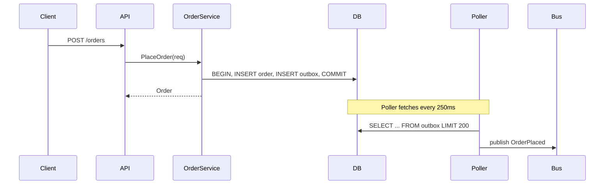

# PR #482 — checkout: rework order pipeline

## Summary

This PR refactors the order-placement pipeline in `server/checkout` to introduce
an outbox-based eventing model. The change is broadly headed in a good direction,
but there are **two correctness issues** in `order_service.go` that block merge,
plus a few _perf_ concerns we should land before traffic ramp.

I read 14 files across 4 packages and ran the test suite. Findings are anchored to
specific code blocks below — click a finding to jump.

```clv:metrics title="Pull request at a glance"
{
  "id": "metrics-summary",
  "columns": 4,
  "items": [
    { "label": "Files changed", "value": 14, "delta": "+3", "trend": "up", "hint": "vs. baseline branch" },
    { "label": "Net LOC", "value": "+486", "delta": "-112 deleted", "trend": "neutral" },
    { "label": "Test coverage", "value": "84.2%", "delta": "+1.2pt", "trend": "up", "hint": "lines covered, package weighted" },
    { "label": "p95 latency", "value": "118 ms", "delta": "-27 ms", "trend": "down", "hint": "from synthetic benchmark" }
  ]
}
```

```clv:callout title="Blocking before merge"
{
  "id": "blocking",
  "kind": "danger",
  "body": "Two correctness issues — duplicate outbox emission on retry, and a missing context cancellation in `ListOrders` — must be fixed before this can land. Both are flagged in the findings table below."
}
```

```clv:tree title="Files changed"
{
  "id": "files",
  "nodes": [
    { "path": "client/orders/api.ts", "status": "renamed", "note": "from client/orders/client.ts" },
    { "path": "client/orders/state.ts", "status": "modified" },
    { "path": "docs/architecture/checkout.md", "status": "modified" },
    { "path": "docs/architecture/checkout.png", "status": "deleted" },
    { "path": "server/checkout/handlers/place_order.go", "status": "modified" },
    { "path": "server/checkout/handlers/refund.go", "status": "modified" },
    { "path": "server/checkout/legacy_emitter.go", "status": "deleted" },
    { "path": "server/checkout/migrations/0014_outbox.sql", "status": "added" },
    { "path": "server/checkout/migrations/0015_index.sql", "status": "added" },
    { "path": "server/checkout/order_service.go", "status": "modified", "note": "core changes", "href": "#code-order-service" },
    { "path": "server/checkout/order_service_test.go", "status": "modified", "note": "new cases" },
    { "path": "server/checkout/outbox.go", "status": "added", "note": "new", "href": "#code-outbox" },
    { "path": "server/checkout/outbox_test.go", "status": "added" },
    { "path": "server/checkout/types.go", "status": "modified" }
  ]
}
```

```clv:findings title="Findings (7)"
{
  "id": "findings",
  "items": [
    { "severity": "critical", "file": "server/checkout/order_service.go", "line": 142, "blockId": "code-order-service", "title": "Duplicate outbox emission on retry", "body": "`PlaceOrder` writes to the outbox **after** the transaction commits. On a transient retry (network blip -> client re-issues), the same intent is committed twice with different `event_id`s. Move the outbox insert inside the same `tx`." },
    { "severity": "critical", "file": "server/checkout/order_service.go", "line": 154, "blockId": "code-order-service", "title": "Context not propagated to ListOrders query", "body": "`ListOrders` calls `db.QueryContext(context.Background(), ...)` — a request cancellation will not interrupt the query, exhausting the connection pool under load." },
    { "severity": "warning", "file": "server/checkout/outbox.go", "line": 64, "blockId": "code-outbox", "title": "Unbounded fetch in poller", "body": "`fetchPending` selects without a `LIMIT`. On backlog it will load thousands of rows into memory. Suggest `LIMIT 200` + cursor." },
    { "severity": "warning", "file": "server/checkout/handlers/refund.go", "line": 31, "title": "Refund handler still uses legacy emitter import", "body": "Stale import after deletion of `legacy_emitter.go`. Compiles via build tags but will break once tags are removed in #487." },
    { "severity": "tip", "file": "client/orders/api.ts", "line": 12, "title": "Consider AbortController for in-flight requests", "body": "Now that the server respects cancellation, the client can wire up `AbortController` to drop stale fetches when the route changes." },
    { "severity": "info", "file": "docs/architecture/checkout.md", "title": "Diagram replaced with Mermaid source", "body": "Good move — easier to keep in sync. The new diagram is rendered below." },
    { "severity": "tip", "file": "server/checkout/order_service.go", "line": 4, "blockId": "code-step-today", "title": "See the step-by-step fix in the walkthrough", "body": "This finding's snippet is sourced from a `clv:code` block nested inside the steps walkthrough." }
  ]
}
```

## Core change — `order_service.go`

The interesting changes are concentrated in `PlaceOrder` and `ListOrders`. Two
annotations are flagged as **critical**; jump from the findings panel above.

```clv:code title="server/checkout/order_service.go"
{
  "id": "code-order-service",
  "file": "server/checkout/order_service.go",
  "lang": "go",
  "startLine": 130,
  "source": "func (s *OrderService) PlaceOrder(ctx context.Context, req PlaceOrderRequest) (*Order, error) {\n    tx, err := s.db.BeginTx(ctx, nil)\n    if err != nil {\n        return nil, fmt.Errorf(\"begin tx: %w\", err)\n    }\n    defer tx.Rollback()\n\n    order, err := s.insertOrder(ctx, tx, req)\n    if err != nil {\n        return nil, err\n    }\n\n    if err := tx.Commit(); err != nil {\n        return nil, fmt.Errorf(\"commit: %w\", err)\n    }\n\n    // Outbox is written AFTER commit — see review.\n    if err := s.outbox.Emit(ctx, OrderPlaced{ID: order.ID}); err != nil {\n        log.Warnf(\"outbox emit failed: %v\", err)\n    }\n    return order, nil\n}\n\nfunc (s *OrderService) ListOrders(userID string) ([]Order, error) {\n    rows, err := s.db.QueryContext(context.Background(),\n        `SELECT id, total FROM orders WHERE user_id = $1`, userID)\n    if err != nil {\n        return nil, err\n    }\n    defer rows.Close()\n    var out []Order\n    for rows.Next() {\n        var o Order\n        if err := rows.Scan(&o.ID, &o.Total); err != nil {\n            return nil, err\n        }\n        out = append(out, o)\n    }\n    return out, nil\n}",
  "annotations": [
    { "line": 142, "kind": "critical", "text": "**Outbox write is outside the transaction.** On retry, you can get duplicate emissions with different `event_id`s. Move the `Emit` inside the `tx` and commit together." },
    { "line": 148, "kind": "warning", "text": "Swallowing the error here means the order is committed but downstream never hears about it. At minimum, bubble this up — even if you don't fail the request." },
    { "line": 154, "kind": "critical", "text": "Hard-coded `context.Background()` discards the caller's context. Use `ctx` and accept it as a parameter." }
  ]
}
```

## Proposed fix

Here is the minimum-diff version that resolves both critical items:

```clv:code title="server/checkout/outbox.go"
{
  "id": "code-outbox",
  "file": "server/checkout/outbox.go",
  "lang": "go",
  "startLine": 58,
  "source": "func (o *Outbox) fetchPending(ctx context.Context) ([]Event, error) {\n    var out []Event\n    rows, err := o.db.QueryContext(ctx,\n        `SELECT id, payload, created_at\n         FROM outbox WHERE published_at IS NULL\n         ORDER BY id`)\n    if err != nil {\n        return nil, err\n    }\n    defer rows.Close()\n    for rows.Next() { /* ...scan... */ }\n    return out, nil\n}",
  "annotations": [
    { "line": 64, "kind": "warning", "text": "No `LIMIT` clause. On backlog this loads thousands of rows into memory. Add `LIMIT 200` and use the last id as a cursor for the next page." }
  ]
}
```

```clv:diff title="Suggested patch — server/checkout/order_service.go"
{
  "id": "diff-fix",
  "file": "server/checkout/order_service.go",
  "lang": "go",
  "mode": "split",
  "from": "    order, err := s.insertOrder(ctx, tx, req)\n    if err != nil {\n        return nil, err\n    }\n\n    if err := tx.Commit(); err != nil {\n        return nil, fmt.Errorf(\"commit: %w\", err)\n    }\n\n    if err := s.outbox.Emit(ctx, OrderPlaced{ID: order.ID}); err != nil {\n        log.Warnf(\"outbox emit failed: %v\", err)\n    }",
  "to": "    order, err := s.insertOrder(ctx, tx, req)\n    if err != nil {\n        return nil, err\n    }\n\n    if err := s.outbox.EmitTx(ctx, tx, OrderPlaced{ID: order.ID}); err != nil {\n        return nil, fmt.Errorf(\"outbox: %w\", err)\n    }\n\n    if err := tx.Commit(); err != nil {\n        return nil, fmt.Errorf(\"commit: %w\", err)\n    }"
}
```

```clv:checklist title="Quality gate"
{
  "id": "rubric",
  "items": [
    { "label": "All tests pass on CI", "status": "pass" },
    { "label": "Coverage >= 80% on touched packages", "status": "pass", "note": "checkout: 84.2%" },
    { "label": "No new `context.Background()` in hot paths", "status": "fail", "note": "order_service.go:154" },
    { "label": "Migrations are backwards-compatible", "status": "pass" },
    { "label": "Public API kept stable", "status": "pass" },
    { "label": "Outbox table has retention policy", "status": "skip", "note": "tracked in #491" },
    { "label": "Mobile client tested", "status": "na", "note": "server-only change" },
    { "label": "Docs updated", "status": "pass" }
  ]
}
```

```clv:tabs title="Outbox poller — implementations considered"
{
  "id": "tabs-impl",
  "tabs": [
    { "label": "Polling (chosen)", "content": "Selected for simplicity. Single goroutine polls every `250ms`, batches up to 200 events, advances cursor. Easy to reason about; tolerates DB restarts." },
    { "label": "Logical replication", "content": "Rejected for MVP — requires Postgres role grants we don't have in all environments. Revisit in Q3 once infra catches up." },
    { "label": "Trigger + NOTIFY", "content": "Rejected — `NOTIFY` payloads are limited to 8KB and we'd need a per-shard listener. Adds operational surface without clear win." }
  ]
}
```

## System view

The new architecture, with the outbox table sitting between the order service and
downstream consumers:

```clv:graph title="Order pipeline after this PR"
{
  "id": "graph-arch",
  "direction": "LR",
  "nodes": [
    { "id": "client", "label": "Web / Mobile", "group": "ext" },
    { "id": "api", "label": "checkout-api", "group": "api" },
    { "id": "svc", "label": "OrderService", "group": "svc" },
    { "id": "db", "label": "orders (Postgres)", "group": "db" },
    { "id": "outbox", "label": "outbox table", "group": "db" },
    { "id": "poller", "label": "outbox-poller", "group": "svc" },
    { "id": "bus", "label": "events (NATS)", "group": "ext" },
    { "id": "fulfil", "label": "fulfilment", "group": "ext" },
    { "id": "ledger", "label": "ledger", "group": "ext" }
  ],
  "edges": [
    { "from": "client", "to": "api", "label": "POST /orders" },
    { "from": "api", "to": "svc" },
    { "from": "svc", "to": "db", "label": "INSERT" },
    { "from": "svc", "to": "outbox", "label": "EmitTx" },
    { "from": "poller", "to": "outbox", "label": "fetch" },
    { "from": "poller", "to": "bus", "label": "publish" },
    { "from": "bus", "to": "fulfil", "style": "dashed" },
    { "from": "bus", "to": "ledger", "style": "dashed" }
  ]
}
```



```clv:chart title="Synthetic benchmark — checkout latency by percentile"
{
  "id": "chart-latency",
  "type": "line",
  "xKey": "load",
  "yKeys": ["before_p50", "before_p95", "after_p50", "after_p95"],
  "height": 240,
  "data": [
    { "load": "10 rps", "before_p50": 31, "before_p95": 92, "after_p50": 24, "after_p95": 71 },
    { "load": "50 rps", "before_p50": 38, "before_p95": 118, "after_p50": 26, "after_p95": 84 },
    { "load": "100 rps", "before_p50": 52, "before_p95": 145, "after_p50": 33, "after_p95": 102 },
    { "load": "200 rps", "before_p50": 78, "before_p95": 190, "after_p50": 45, "after_p95": 118 },
    { "load": "400 rps", "before_p50": 142, "before_p95": 312, "after_p50": 81, "after_p95": 184 },
    { "load": "600 rps", "before_p50": 228, "before_p95": 470, "after_p50": 122, "after_p95": 246 }
  ]
}
```

```clv:table title="Per-endpoint benchmark (400 rps, 60 s)"
{
  "id": "tbl-bench",
  "columns": [
    { "key": "endpoint", "label": "Endpoint", "align": "left", "sortable": true },
    { "key": "p50", "label": "p50 (ms)", "align": "right", "sortable": true },
    { "key": "p95", "label": "p95 (ms)", "align": "right", "sortable": true },
    { "key": "err", "label": "Errors", "align": "right", "sortable": true },
    { "key": "verdict", "label": "Verdict", "align": "center" }
  ],
  "rows": [
    { "endpoint": "POST /orders", "p50": 45, "p95": 118, "err": "0.00%", "verdict": "pass" },
    { "endpoint": "GET /orders/:id", "p50": 8, "p95": 22, "err": "0.00%", "verdict": "pass" },
    { "endpoint": "GET /orders", "p50": 110, "p95": 414, "err": "0.12%", "verdict": "warn" },
    { "endpoint": "POST /orders/refund", "p50": 62, "p95": 148, "err": "0.00%", "verdict": "pass" },
    { "endpoint": "POST /webhooks/replay", "p50": 38, "p95": 96, "err": "0.00%", "verdict": "pass" }
  ]
}
```

```clv:timeline title="Suggested rollout"
{
  "id": "timeline-roll",
  "events": [
    { "at": "step 1", "title": "Land patch behind feature flag", "body": "Flag: `checkout.outbox.enabled`. Off in prod by default.", "kind": "info" },
    { "at": "step 2", "title": "Backfill outbox table", "body": "Run `migrations/0014` + idempotent backfill job overnight.", "kind": "info" },
    { "at": "step 3", "title": "Enable on internal traffic (1%)", "body": "Watch p95 and error rate dashboards for 24h.", "kind": "tip" },
    { "at": "step 4", "title": "Ramp to 10% -> 50% -> 100%", "body": "Each step held for 4h. Alarms hooked to PagerDuty.", "kind": "warning" },
    { "at": "step 5", "title": "Delete legacy emitter path", "body": "Drop `legacy_emitter.go` and remove build tags.", "kind": "danger" }
  ]
}
```

```clv:steps title="Walkthrough — how the outbox write moves"
{
  "id": "steps-refactor",
  "initial": 0,
  "steps": [
    {
      "title": "Today — emit after commit",
      "body": "Current code emits to the outbox **after** the transaction commits. A retry on the wire causes duplicate emission.",
      "block": {
        "type": "code",
        "data": {
          "id": "code-step-today",
          "lang": "go",
          "startLine": 1,
          "source": "if err := tx.Commit(); err != nil {\n    return nil, err\n}\ns.outbox.Emit(ctx, OrderPlaced{ID: order.ID}) // outside tx",
          "annotations": [
            { "line": 4, "kind": "critical", "text": "Emitting outside the committed transaction is the root cause." }
          ]
        }
      }
    },
    {
      "title": "Step 1 — accept the tx in EmitTx",
      "body": "Add a sibling method that takes the active transaction so the outbox row can be written atomically.",
      "block": {
        "type": "code",
        "data": {
          "lang": "go",
          "source": "func (o *Outbox) EmitTx(ctx context.Context, tx *sql.Tx, e Event) error {\n    _, err := tx.ExecContext(ctx, `INSERT INTO outbox ...`, e)\n    return err\n}"
        }
      }
    },
    {
      "title": "Step 2 — call EmitTx before commit",
      "body": "Reorder so both inserts share the transaction. If either fails the whole thing rolls back.",
      "block": {
        "type": "code",
        "data": {
          "lang": "go",
          "source": "if err := s.outbox.EmitTx(ctx, tx, OrderPlaced{ID: order.ID}); err != nil {\n    return nil, fmt.Errorf(\"outbox: %w\", err)\n}\nif err := tx.Commit(); err != nil {\n    return nil, fmt.Errorf(\"commit: %w\", err)\n}"
        }
      }
    },
    {
      "title": "Done — exactly-once at the boundary",
      "body": "The poller delivers at-least-once downstream, but the order row and the outbox row are now committed atomically."
    }
  ]
}
```

```clv:callout title="Overall"
{
  "id": "wrap",
  "kind": "tip",
  "body": "Once the two critical items are fixed, this is ready. The benchmark numbers are real — please re-run after the patch to confirm we haven't regressed."
}
```

The block below is intentionally an **unknown** type, to demonstrate the graceful
fallback render (raw JSON in a red frame):

```clv:capacity-plan
{ "horizon_days": 30, "growth": "12%" }
```
