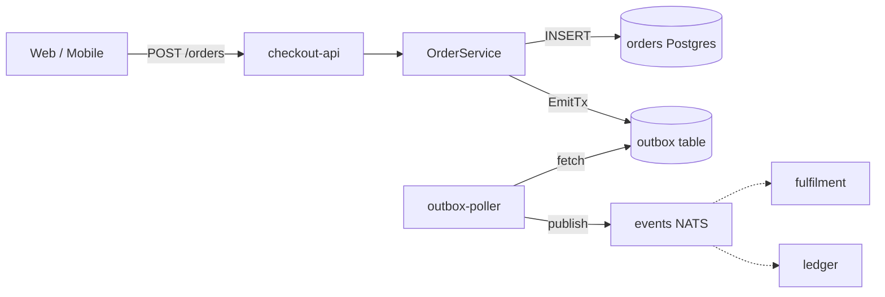
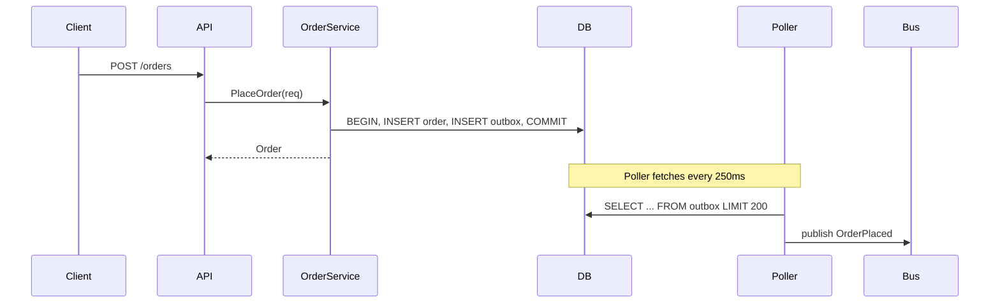

# PR #482 — checkout: rework order pipeline

This is a **plain-markdown** review of PR #482, mirroring [`review.clv.md`](review.clv.md)
(the clv-flavored version with interactive blocks) using standard CommonMark plus
GitHub-flavored markdown. Where a clv block adds interactivity, this document
approximates it with a table, list, or mermaid diagram.

## Summary

This PR refactors the order-placement pipeline in `server/checkout` to introduce
an outbox-based eventing model. The change is broadly headed in a good direction,
but there are **two correctness issues** in `order_service.go` that block merge,
plus a few _perf_ concerns we should land before traffic ramp.

I read 14 files across 4 packages and ran the test suite. Findings are listed
below with file and line references.

### At a glance

| Metric        | Value  | Delta        | Trend   | Note                        |
| ------------- | ------ | ------------ | ------- | --------------------------- |
| Files changed | 14     | +3           | up      | vs. baseline branch         |
| Net LOC       | +486   | -112 deleted | neutral |                             |
| Test coverage | 84.2%  | +1.2pt       | up      | lines covered, pkg weighted |
| p95 latency   | 118 ms | -27 ms       | down    | from synthetic benchmark    |

> **Blocking before merge.** Two correctness issues — duplicate outbox emission
> on retry, and a missing context cancellation in `ListOrders` — must be fixed
> before this can land. Both are flagged in the findings table below.

## Files changed

| File                                         | Status   | Note                           |
| -------------------------------------------- | -------- | ------------------------------ |
| `client/orders/api.ts`                       | renamed  | from `client/orders/client.ts` |
| `client/orders/state.ts`                     | modified |                                |
| `docs/architecture/checkout.md`              | modified |                                |
| `docs/architecture/checkout.png`             | deleted  |                                |
| `server/checkout/handlers/place_order.go`    | modified |                                |
| `server/checkout/handlers/refund.go`         | modified |                                |
| `server/checkout/legacy_emitter.go`          | deleted  |                                |
| `server/checkout/migrations/0014_outbox.sql` | added    |                                |
| `server/checkout/migrations/0015_index.sql`  | added    |                                |
| `server/checkout/order_service.go`           | modified | core changes                   |
| `server/checkout/order_service_test.go`      | modified | new cases                      |
| `server/checkout/outbox.go`                  | added    | new                            |
| `server/checkout/outbox_test.go`             | added    |                                |
| `server/checkout/types.go`                   | modified |                                |

## Findings (7)

| # | Severity | Location                        | Finding                                                                                                                                                                                                                        |
| - | -------- | ------------------------------- | ------------------------------------------------------------------------------------------------------------------------------------------------------------------------------------------------------------------------------ |
| 1 | critical | `order_service.go:142`          | **Duplicate outbox emission on retry.** `PlaceOrder` writes to the outbox _after_ the transaction commits. A transient retry commits the intent twice with different `event_id`s. Move the outbox insert inside the same `tx`. |
| 2 | critical | `order_service.go:154`          | **Context not propagated to `ListOrders`.** It calls `db.QueryContext(context.Background(), ...)` — a request cancellation won't interrupt the query, exhausting the connection pool under load.                               |
| 3 | warning  | `outbox.go:64`                  | **Unbounded fetch in poller.** `fetchPending` selects without a `LIMIT`. On backlog it loads thousands of rows into memory. Suggest `LIMIT 200` + cursor.                                                                      |
| 4 | warning  | `handlers/refund.go:31`         | **Refund handler still imports the legacy emitter.** Stale import after deleting `legacy_emitter.go`. Compiles via build tags but breaks once tags are removed in #487.                                                        |
| 5 | tip      | `client/orders/api.ts:12`       | **Consider `AbortController`.** Now that the server respects cancellation, the client can drop stale fetches when the route changes.                                                                                           |
| 6 | info     | `docs/architecture/checkout.md` | **Diagram replaced with Mermaid source.** Good move — easier to keep in sync. The new diagram is rendered below.                                                                                                               |
| 7 | tip      | `order_service.go`              | **See the step-by-step fix** in the walkthrough at the end of this document.                                                                                                                                                   |

## Core change — `order_service.go`

The interesting changes are concentrated in `PlaceOrder` and `ListOrders`. The
two **critical** annotations correspond to findings 1 and 2.

```go
func (s *OrderService) PlaceOrder(ctx context.Context, req PlaceOrderRequest) (*Order, error) {
    tx, err := s.db.BeginTx(ctx, nil)
    if err != nil {
        return nil, fmt.Errorf("begin tx: %w", err)
    }
    defer tx.Rollback()

    order, err := s.insertOrder(ctx, tx, req)
    if err != nil {
        return nil, err
    }

    if err := tx.Commit(); err != nil {
        return nil, fmt.Errorf("commit: %w", err)
    }

    // Outbox is written AFTER commit — see review (critical).
    if err := s.outbox.Emit(ctx, OrderPlaced{ID: order.ID}); err != nil {
        log.Warnf("outbox emit failed: %v", err) // swallowed — see review (warning)
    }
    return order, nil
}

func (s *OrderService) ListOrders(userID string) ([]Order, error) {
    rows, err := s.db.QueryContext(context.Background(), // hard-coded context — critical
        `SELECT id, total FROM orders WHERE user_id = $1`, userID)
    if err != nil {
        return nil, err
    }
    defer rows.Close()
    var out []Order
    for rows.Next() {
        var o Order
        if err := rows.Scan(&o.ID, &o.Total); err != nil {
            return nil, err
        }
        out = append(out, o)
    }
    return out, nil
}
```

- **Line 142** (critical): the outbox write is outside the transaction. On retry,
  you can get duplicate emissions with different `event_id`s. Move the `Emit`
  inside the `tx` and commit together.
- **Line 148** (warning): swallowing the error means the order is committed but
  downstream never hears about it. At minimum, bubble this up.
- **Line 154** (critical): hard-coded `context.Background()` discards the caller's
  context. Use `ctx` and accept it as a parameter.

## Proposed fix

The new poller's `fetchPending` (finding 3 — add a `LIMIT`):

```go
func (o *Outbox) fetchPending(ctx context.Context) ([]Event, error) {
    var out []Event
    rows, err := o.db.QueryContext(ctx,
        `SELECT id, payload, created_at
         FROM outbox WHERE published_at IS NULL
         ORDER BY id`) // no LIMIT — add LIMIT 200 + cursor
    if err != nil {
        return nil, err
    }
    defer rows.Close()
    for rows.Next() { /* ...scan... */ }
    return out, nil
}
```

Minimum-diff version that resolves both critical items in `order_service.go`:

```diff
--- a/server/checkout/order_service.go
+++ b/server/checkout/order_service.go
     order, err := s.insertOrder(ctx, tx, req)
     if err != nil {
         return nil, err
     }

+    if err := s.outbox.EmitTx(ctx, tx, OrderPlaced{ID: order.ID}); err != nil {
+        return nil, fmt.Errorf("outbox: %w", err)
+    }
+
     if err := tx.Commit(); err != nil {
         return nil, fmt.Errorf("commit: %w", err)
     }
-
-    if err := s.outbox.Emit(ctx, OrderPlaced{ID: order.ID}); err != nil {
-        log.Warnf("outbox emit failed: %v", err)
-    }
```

## Quality gate

- [x] All tests pass on CI
- [x] Coverage >= 80% on touched packages — checkout: 84.2%
- [ ] No new `context.Background()` in hot paths — `order_service.go:154`
- [x] Migrations are backwards-compatible
- [x] Public API kept stable
- [ ] Outbox table has retention policy — tracked in #491
- [ ] Mobile client tested — server-only change (n/a)
- [x] Docs updated

## Outbox poller — implementations considered

### Polling (chosen)

Selected for simplicity. A single goroutine polls every `250ms`, batches up to
200 events, advances a cursor. Easy to reason about; tolerates DB restarts.

### Logical replication

Rejected for MVP — requires Postgres role grants we don't have in all
environments. Revisit in Q3 once infra catches up.

### Trigger + NOTIFY

Rejected — `NOTIFY` payloads are limited to 8KB and we'd need a per-shard
listener. Adds operational surface without a clear win.

## System view

The new architecture, with the outbox table sitting between the order service and
downstream consumers:



Request / poller sequence:



## Synthetic benchmark — checkout latency by percentile

Plain markdown can't draw a chart; the series are shown as a table (latency in ms,
before vs. after this PR).

| Load    | before p50 | before p95 | after p50 | after p95 |
| ------- | ---------: | ---------: | --------: | --------: |
| 10 rps  |         31 |         92 |        24 |        71 |
| 50 rps  |         38 |        118 |        26 |        84 |
| 100 rps |         52 |        145 |        33 |       102 |
| 200 rps |         78 |        190 |        45 |       118 |
| 400 rps |        142 |        312 |        81 |       184 |
| 600 rps |        228 |        470 |       122 |       246 |

### Per-endpoint benchmark (400 rps, 60 s)

| Endpoint                | p50 (ms) | p95 (ms) | Errors | Verdict |
| ----------------------- | -------: | -------: | -----: | :-----: |
| `POST /orders`          |       45 |      118 |  0.00% |  pass   |
| `GET /orders/:id`       |        8 |       22 |  0.00% |  pass   |
| `GET /orders`           |      110 |      414 |  0.12% |  warn   |
| `POST /orders/refund`   |       62 |      148 |  0.00% |  pass   |
| `POST /webhooks/replay` |       38 |       96 |  0.00% |  pass   |

## Suggested rollout

| Step   | Action                          | Detail                                                     |
| ------ | ------------------------------- | ---------------------------------------------------------- |
| step 1 | Land patch behind feature flag  | Flag: `checkout.outbox.enabled`. Off in prod by default.   |
| step 2 | Backfill outbox table           | Run `migrations/0014` + idempotent backfill job overnight. |
| step 3 | Enable on internal traffic (1%) | Watch p95 and error rate dashboards for 24h.               |
| step 4 | Ramp to 10% -> 50% -> 100%      | Each step held for 4h. Alarms hooked to PagerDuty.         |
| step 5 | Delete legacy emitter path      | Drop `legacy_emitter.go` and remove build tags.            |

## Walkthrough — how the outbox write moves

1. **Today — emit after commit.** Current code emits to the outbox _after_ the
   transaction commits. A retry on the wire causes duplicate emission.

   ```go
   if err := tx.Commit(); err != nil {
       return nil, err
   }
   s.outbox.Emit(ctx, OrderPlaced{ID: order.ID}) // outside tx — root cause
   ```

2. **Step 1 — accept the tx in `EmitTx`.** Add a sibling method that takes the
   active transaction so the outbox row can be written atomically.

   ```go
   func (o *Outbox) EmitTx(ctx context.Context, tx *sql.Tx, e Event) error {
       _, err := tx.ExecContext(ctx, `INSERT INTO outbox ...`, e)
       return err
   }
   ```

3. **Step 2 — call `EmitTx` before commit.** Reorder so both inserts share the
   transaction. If either fails the whole thing rolls back.

   ```go
   if err := s.outbox.EmitTx(ctx, tx, OrderPlaced{ID: order.ID}); err != nil {
       return nil, fmt.Errorf("outbox: %w", err)
   }
   if err := tx.Commit(); err != nil {
       return nil, fmt.Errorf("commit: %w", err)
   }
   ```

4. **Done — exactly-once at the boundary.** The poller delivers at-least-once
   downstream, but the order row and the outbox row are now committed atomically.

## Overall

> **Tip.** Once the two critical items are fixed, this is ready. The benchmark
> numbers are real — please re-run after the patch to confirm we haven't
> regressed.
