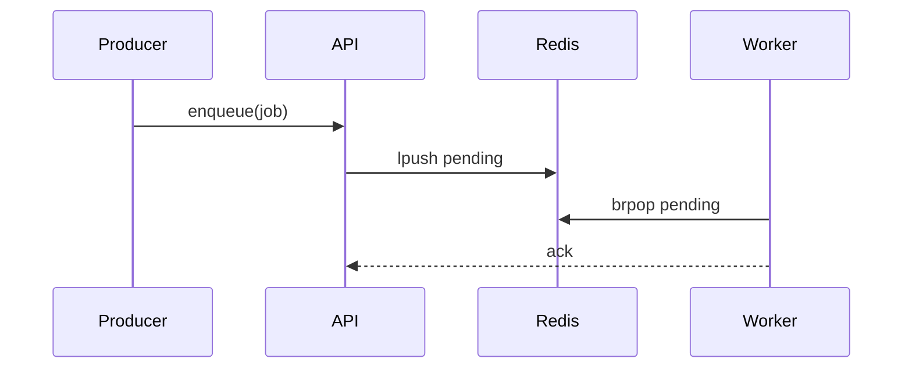

# clv block showcase

This document is a complete, **valid** tour of every clv block type. Run
`clv doc` to print it, or `clv examples/showcase.clv.md` to preview it. For one
block's detailed reference (schema + a worked example), run `clv doc <block>`
(e.g. `clv doc callout`).

A clv block is a fenced code block whose info string is `clv:<type>` and whose
body is a **single JSON object** that must parse with `JSON.parse` (double-quoted
keys/strings, no comments, no trailing commas). There are exactly **14** valid
types:

- `callout`, `code`, `diff`, `tree`, `findings`, `checklist`, `metrics`
- `chart`, `table`, `graph`, `timeline`, `mermaid`, `tabs`, `steps`

Every block also accepts the common optional fields `title`, `collapsed`, and
`id` (an anchor target). Anything else renders as a clearly-marked fallback. For
the full schema of each type see [`docs/output-style-clv.md`](../docs/output-style-clv.md).

The theme below is a short walkthrough of a fictional **Tasklet** background-job
service.

````clv:callout title="What you are looking at"
{
  "id": "intro-callout",
  "kind": "info",
  "body": "Each section demonstrates one block type with valid JSON. The `clv:tabs` and `clv:steps` blocks near the end show how to **nest** other blocks, and there is both a `clv:mermaid` block and a bare ` ```mermaid ` fence."
}
````

## At a glance — metrics

```clv:metrics title="Tasklet at a glance"
{
  "columns": 4,
  "items": [
    { "label": "Workers", "value": 8, "trend": "neutral", "hint": "autoscaled 4–16" },
    { "label": "Jobs / min", "value": "1,240", "delta": "+9%", "trend": "up" },
    { "label": "p95 latency", "value": "84 ms", "delta": "-12 ms", "trend": "down" },
    { "label": "Failure rate", "value": "0.3%", "delta": "+0.1pt", "trend": "up", "hint": "watch this" }
  ]
}
```

## Annotated source — code

The enqueue path is small. Two lines are annotated; the findings panel below
links straight to them.

```clv:code title="tasklet/queue.ts"
{
  "id": "code-enqueue",
  "lang": "typescript",
  "file": "tasklet/queue.ts",
  "startLine": 40,
  "highlightLines": [43],
  "source": "export async function enqueue(job: Job): Promise<string> {\n  const id = crypto.randomUUID();\n  await redis.lpush(\"tasklet:pending\", JSON.stringify({ id, ...job }));\n  metrics.incr(\"tasklet.enqueued\");\n  return id;\n}",
  "annotations": [
    { "line": 42, "kind": "warning", "text": "No max-length guard on the list — a producer burst can grow `tasklet:pending` unbounded." },
    { "line": 43, "kind": "tip", "text": "Only a throughput counter is emitted here — capture the depth returned by `lpush` and export it as a gauge so backlog is observable, not just the enqueue rate." }
  ]
}
```

## Before / after — diff

```clv:diff title="Make enqueue bounded"
{
  "lang": "typescript",
  "file": "tasklet/queue.ts",
  "mode": "unified",
  "from": "  await redis.lpush(\"tasklet:pending\", JSON.stringify({ id, ...job }));\n  metrics.incr(\"tasklet.enqueued\");",
  "to": "  const depth = await redis.lpush(\"tasklet:pending\", JSON.stringify({ id, ...job }));\n  if (depth > MAX_DEPTH) await redis.ltrim(\"tasklet:pending\", 0, MAX_DEPTH - 1);\n  metrics.incr(\"tasklet.enqueued\");"
}
```

## Changed files — tree

```clv:tree title="Files in this change"
{
  "nodes": [
    { "path": "tasklet/queue.ts", "status": "modified", "note": "bounded enqueue", "href": "#code-enqueue" },
    { "path": "tasklet/worker.ts", "status": "modified" },
    { "path": "tasklet/config.ts", "status": "added", "note": "new MAX_DEPTH" },
    { "path": "tasklet/legacy_poll.ts", "status": "deleted" },
    { "path": "docs/tasklet.md", "status": "renamed", "note": "from docs/jobs.md" }
  ]
}
```

## Review findings — findings

```clv:findings title="Findings (3)"
{
  "items": [
    { "severity": "warning", "file": "tasklet/queue.ts", "line": 42, "blockId": "code-enqueue", "title": "Unbounded pending list", "body": "Add a depth guard so a producer burst can't exhaust Redis memory. See the highlighted line." },
    { "severity": "tip", "file": "tasklet/queue.ts", "line": 43, "blockId": "code-enqueue", "title": "Emit a backlog gauge, not just a counter", "body": "`tasklet.enqueued` measures throughput only. Capture the depth returned by `lpush` to expose backlog, so alerts can fire before the list grows unbounded." },
    { "severity": "info", "file": "tasklet/worker.ts", "title": "Graceful shutdown looks good", "body": "Workers drain in-flight jobs on SIGTERM — no change needed." }
  ]
}
```

## Quality gate — checklist

```clv:checklist title="Release checklist"
{
  "items": [
    { "label": "Unit tests pass", "status": "pass" },
    { "label": "Load test at 2× peak", "status": "pass", "note": "held p95 < 100ms" },
    { "label": "Bounded enqueue merged", "status": "fail", "note": "this PR" },
    { "label": "Runbook updated", "status": "skip", "note": "tracked separately" },
    { "label": "Mobile client impact", "status": "na", "note": "backend only" }
  ]
}
```

## Throughput — chart

```clv:chart title="Jobs processed per minute"
{
  "type": "line",
  "xKey": "time",
  "yKeys": ["enqueued", "completed"],
  "height": 240,
  "data": [
    { "time": "09:00", "enqueued": 820, "completed": 810 },
    { "time": "09:05", "enqueued": 1100, "completed": 1040 },
    { "time": "09:10", "enqueued": 1320, "completed": 1180 },
    { "time": "09:15", "enqueued": 1240, "completed": 1230 },
    { "time": "09:20", "enqueued": 980, "completed": 990 }
  ]
}
```

## Per-queue breakdown — table

```clv:table title="Queues"
{
  "columns": [
    { "key": "queue", "label": "Queue", "align": "left", "sortable": true },
    { "key": "depth", "label": "Depth", "align": "right", "sortable": true },
    { "key": "workers", "label": "Workers", "align": "right" },
    { "key": "status", "label": "Status", "align": "center" }
  ],
  "rows": [
    { "queue": "email", "depth": 12, "workers": 3, "status": "ok" },
    { "queue": "thumbnails", "depth": 340, "workers": 4, "status": "busy" },
    { "queue": "exports", "depth": 0, "workers": 1, "status": "idle" }
  ],
  "caption": "Snapshot at 09:15"
}
```

## Architecture — graph

```clv:graph title="Tasklet data flow"
{
  "direction": "LR",
  "nodes": [
    { "id": "prod", "label": "Producers", "group": "ext" },
    { "id": "api", "label": "enqueue API", "group": "api" },
    { "id": "redis", "label": "Redis queue", "group": "db" },
    { "id": "worker", "label": "Workers", "group": "svc" },
    { "id": "sink", "label": "Downstream", "group": "ext" }
  ],
  "edges": [
    { "from": "prod", "to": "api", "label": "submit" },
    { "from": "api", "to": "redis", "label": "lpush" },
    { "from": "worker", "to": "redis", "label": "brpop" },
    { "from": "worker", "to": "sink", "style": "dashed" }
  ]
}
```

## Rollout — timeline

```clv:timeline title="Rollout plan"
{
  "events": [
    { "at": "day 1", "title": "Ship behind flag", "body": "`tasklet.bounded` off by default.", "kind": "info" },
    { "at": "day 2", "title": "Enable in staging", "body": "Soak for 24h, watch failure rate.", "kind": "tip" },
    { "at": "day 4", "title": "Ramp prod to 50%", "kind": "warning" },
    { "at": "day 6", "title": "Remove legacy poller", "kind": "danger" }
  ]
}
```

## Diagrams — mermaid

A `clv:mermaid` block takes its diagram source from the JSON `source` field:

```clv:mermaid title="Job lifecycle"
{
  "source": "stateDiagram-v2\n  [*] --> Pending\n  Pending --> Running\n  Running --> Done\n  Running --> Failed\n  Failed --> Pending\n  Done --> [*]"
}
```

You can also write a bare `` ```mermaid `` fence (no `clv:` prefix); the whole
fence body is the diagram source. In a `sequenceDiagram`, keep message text free
of raw semicolons — `;` is a statement separator.



## Alternatives considered — tabs (with a nested block)

A `clv:tabs` block can mix Markdown `content` tabs with a tab that nests another
block via `{ "type": ..., "data": ... }`.

```clv:tabs title="Queue backend options"
{
  "id": "tabs-backends",
  "tabs": [
    { "label": "Redis (chosen)", "content": "Already operated in-house; `lpush`/`brpop` give us the at-least-once semantics we need with minimal moving parts." },
    { "label": "SQS", "content": "Managed and durable, but cross-region latency and per-message cost made it a poor fit for our 1k+/min volume." },
    {
      "label": "Config snippet",
      "block": {
        "type": "code",
        "data": {
          "lang": "typescript",
          "source": "export const MAX_DEPTH = 50_000;\nexport const VISIBILITY_MS = 30_000;"
        }
      }
    }
  ]
}
```

## How the fix lands — steps (with a nested block)

A `clv:steps` block plays through ordered steps. Each step uses `body` (Markdown),
a nested `block`, or both.

```clv:steps title="Applying the bounded-enqueue fix"
{
  "id": "steps-fix",
  "initial": 0,
  "steps": [
    {
      "title": "Add the limit",
      "body": "Introduce `MAX_DEPTH` in `config.ts` so the cap is configurable per environment."
    },
    {
      "title": "Trim on overflow",
      "body": "Check the depth returned by `lpush` and trim the tail when it exceeds the cap.",
      "block": {
        "type": "code",
        "data": {
          "lang": "typescript",
          "source": "const depth = await redis.lpush(KEY, payload);\nif (depth > MAX_DEPTH) {\n  await redis.ltrim(KEY, 0, MAX_DEPTH - 1);\n}"
        }
      }
    },
    {
      "title": "Verify",
      "body": "Re-run the load test; the pending list should plateau at `MAX_DEPTH` under burst."
    }
  ]
}
```

## Collapsed by default

Blocks can ship folded with `collapsed: true` — handy for long appendices.

```clv:callout title="Appendix (collapsed)"
{
  "id": "appendix",
  "kind": "tip",
  "collapsed": true,
  "body": "This callout sets `collapsed: true`, so the viewer renders it folded until you expand it."
}
```
