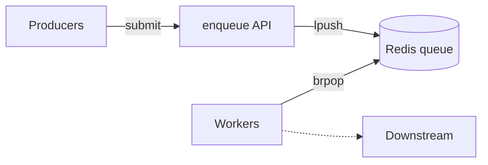
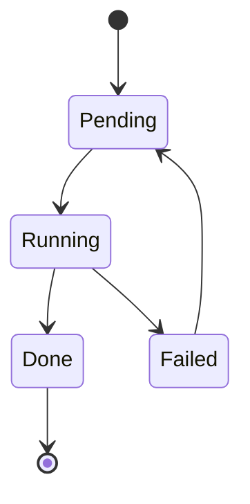
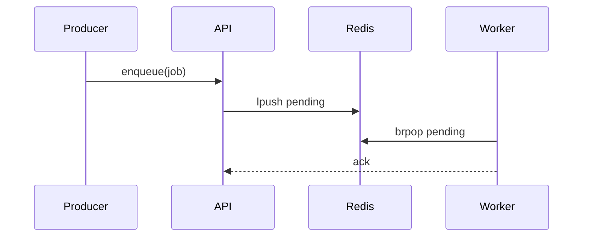

# Markdown showcase

This is a **plain-markdown** document — standard CommonMark plus GitHub-flavored
extensions (tables, task lists, fenced code, `` ```mermaid `` and `` ```diff ``
fences). It mirrors the content of [`showcase.clv.md`](showcase.clv.md), the
clv-flavored version that uses interactive `clv:<type>` blocks, expressed with as
much as plain markdown can render.

The theme below is a short walkthrough of a fictional **Tasklet** background-job
service.

> **What you are looking at.** Each section demonstrates one standard markdown
> feature. Where a clv block adds interactivity (charts, graphs, tabs, steps),
> this document approximates it with a table, list, or mermaid diagram and a brief
> note. The interactive version lives in `showcase.clv.md`.

## At a glance — metrics

| Metric       | Value | Delta  | Trend   | Note            |
| ------------ | ----- | ------ | ------- | --------------- |
| Workers      | 8     | —      | neutral | autoscaled 4–16 |
| Jobs / min   | 1,240 | +9%    | up      |                 |
| p95 latency  | 84 ms | -12 ms | down    |                 |
| Failure rate | 0.3%  | +0.1pt | up      | watch this      |

## Annotated source — code

The enqueue path is small. The findings list below points at the two lines worth
attention.

```typescript
// tasklet/queue.ts
export async function enqueue(job: Job): Promise<string> {
	const id = crypto.randomUUID();
	await redis.lpush("tasklet:pending", JSON.stringify({ id, ...job }));
	metrics.incr("tasklet.enqueued");
	return id;
}
```

- **Line 3** (warning): no max-length guard on the list — a producer burst can
  grow `tasklet:pending` unbounded.
- **Line 4** (tip): only a throughput counter is emitted here — capture the depth
  returned by `lpush` and export it as a gauge so backlog is observable, not just
  the enqueue rate.

## Before / after — diff

```diff
--- a/tasklet/queue.ts
+++ b/tasklet/queue.ts
-  await redis.lpush("tasklet:pending", JSON.stringify({ id, ...job }));
-  metrics.incr("tasklet.enqueued");
+  const depth = await redis.lpush("tasklet:pending", JSON.stringify({ id, ...job }));
+  if (depth > MAX_DEPTH) await redis.ltrim("tasklet:pending", 0, MAX_DEPTH - 1);
+  metrics.incr("tasklet.enqueued");
```

## Changed files — tree

| File                     | Status   | Note                |
| ------------------------ | -------- | ------------------- |
| `tasklet/queue.ts`       | modified | bounded enqueue     |
| `tasklet/worker.ts`      | modified |                     |
| `tasklet/config.ts`      | added    | new `MAX_DEPTH`     |
| `tasklet/legacy_poll.ts` | deleted  |                     |
| `docs/tasklet.md`        | renamed  | from `docs/jobs.md` |

## Review findings

1. **Unbounded pending list** — `tasklet/queue.ts:42` (warning). Add a depth
   guard so a producer burst can't exhaust Redis memory.
2. **Emit a backlog gauge, not just a counter** — `tasklet/queue.ts:43` (tip).
   `tasklet.enqueued` measures throughput only. Capture the depth returned by
   `lpush` to expose backlog, so alerts can fire before the list grows unbounded.
3. **Graceful shutdown looks good** — `tasklet/worker.ts` (info). Workers drain
   in-flight jobs on SIGTERM — no change needed.

## Quality gate — checklist

- [x] Unit tests pass
- [x] Load test at 2× peak — held p95 < 100ms
- [ ] Bounded enqueue merged — this PR
- [ ] Runbook updated — tracked separately
- [ ] Mobile client impact — backend only (n/a)

## Throughput

Plain markdown can't draw a chart, so the series are shown as a table (jobs
processed per minute).

| Time  | Enqueued | Completed |
| ----- | -------- | --------- |
| 09:00 | 820      | 810       |
| 09:05 | 1,100    | 1,040     |
| 09:10 | 1,320    | 1,180     |
| 09:15 | 1,240    | 1,230     |
| 09:20 | 980      | 990       |

## Per-queue breakdown — table

| Queue      | Depth | Workers | Status |
| ---------- | ----: | ------: | :----: |
| email      |    12 |       3 |   ok   |
| thumbnails |   340 |       4 |  busy  |
| exports    |     0 |       1 |  idle  |

_Snapshot at 09:15._

## Architecture

A mermaid graph stands in for the interactive node/edge diagram.



## Rollout — timeline

| When  | Step                 | Detail                            |
| ----- | -------------------- | --------------------------------- |
| day 1 | Ship behind flag     | `tasklet.bounded` off by default. |
| day 2 | Enable in staging    | Soak for 24h, watch failure rate. |
| day 4 | Ramp prod to 50%     |                                   |
| day 6 | Remove legacy poller |                                   |

## Diagrams — mermaid

A bare `` ```mermaid `` fence renders the diagram from the fence body. In a
`sequenceDiagram`, keep message text free of raw semicolons — `;` is a statement
separator.

Job lifecycle:



Enqueue / dequeue sequence:



## Alternatives considered

Plain markdown has no tabs; the options are listed as sections instead.

### Redis (chosen)

Already operated in-house; `lpush`/`brpop` give us the at-least-once semantics we
need with minimal moving parts.

### SQS

Managed and durable, but cross-region latency and per-message cost made it a poor
fit for our 1k+/min volume.

### Config snippet

```typescript
export const MAX_DEPTH = 50_000;
export const VISIBILITY_MS = 30_000;
```

## How the fix lands — steps

Plain markdown has no step player; the steps are an ordered list.

1. **Add the limit.** Introduce `MAX_DEPTH` in `config.ts` so the cap is
   configurable per environment.
2. **Trim on overflow.** Check the depth returned by `lpush` and trim the tail
   when it exceeds the cap.

   ```typescript
   const depth = await redis.lpush(KEY, payload);
   if (depth > MAX_DEPTH) {
   	await redis.ltrim(KEY, 0, MAX_DEPTH - 1);
   }
   ```

3. **Verify.** Re-run the load test; the pending list should plateau at
   `MAX_DEPTH` under burst.

## Appendix

> **Tip.** In the clv-flavored version this section ships folded with
> `collapsed: true`. Plain markdown has no collapse, so it is shown inline.

## Markdown feature reference

A few extra standard-markdown features, rendered the way clv now styles them.

### Highlighted code

Fenced blocks are syntax-highlighted for many languages, e.g. YAML config:

```yaml
tasklet:
  bounded: true
  max_depth: 50000
  visibility_ms: 30000
```

…and Rust:

```rust
fn enqueue(job: Job) -> Result<String, Error> {
    let id = Uuid::new_v4().to_string();
    redis.lpush("tasklet:pending", &job)?;
    Ok(id)
}
```

### Blockquote

> Backlog is a queue property, not a request property — measure depth, not just
> enqueue rate.

### Task list

- [x] Depth gauge exported
- [ ] Alert wired to the gauge

### Footnotes

The bounded enqueue trims the tail when the list overflows the cap.[^cap]

[^cap]: `MAX_DEPTH` defaults to 50,000 and is configurable per environment.

### Math

Inline: the failure budget is $E = mc^2$ — figuratively, errors scale with
mass under load. A display equation:

$$
p_{95} = \mu + 1.645\,\sigma
$$

### Inline HTML

Press <kbd>Ctrl</kbd>+<kbd>C</kbd> to stop the local worker.
